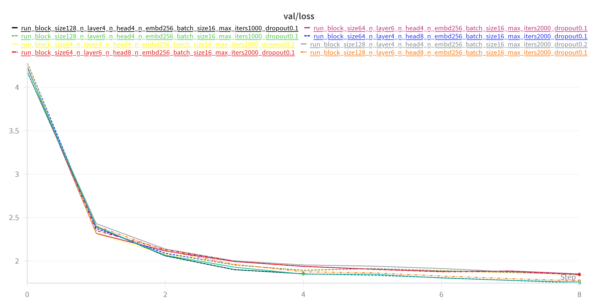
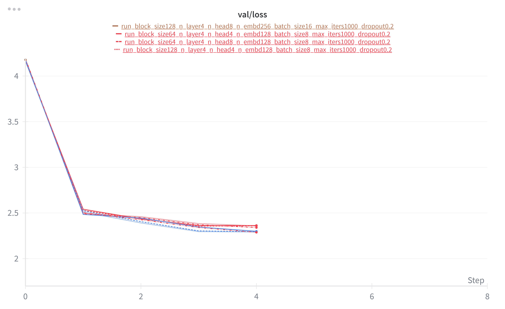

```
├── README.md
├── all_train_outputs.txt # Contains the collected output from all the training commands
├── config_generation.py # takes the parameter grid in and generates a shell script to run each necessary instance of the model
├── train_all_configs.sh # Shell script containing 128 model configs
├── worst10valloss.png
├── best10valloss.png
└── nanoGPT/ # Minimal Reproduction of nanoGPT, with only necessary files to train and model the shakespeare-char
    ├── train.py
    ├── sample.py
    ├── model.py
    ├── configurator.py
    ├── config/
    │   ├── finetune_shakespeare.py
    │   └── train_shakespeare_char.py
    └── data/
        └── shakespeare_char/
            ├── input.txt
            ├── meta.pkl
            ├── prepare.py
            ├── tain.bin
            └── val.bin
```
The following link accesses the complete saved versions of each iteration of the model (too large to zip and save to github): https://drive.google.com/drive/folders/1TMR02psLbr8Ic2hmhVnRcpljq9AzqC_Y?usp=sharing

The following link accesses the logging on wandb.ai: https://wandb.ai/cjackson692-university-of-north-texas/nanoGPT_testing_gp1?nw=nwusercjackson692

The best model used the following parameters:
    *block_size=128 
    *n_layer=4
    *n_head=4 
    *n_embd=256 
    *batch_size=16
    *max_iters=2000
    *dropout=0.1

Plot showing the validation loss of the best 10 runs:


The worst model used the following parameters:
    *block_size=64
    *n_layer=4
    *n_head=4 
    *n_embd=128 
    *batch_size=8
    *max_iters=1000
    *dropout=0.2
    

Plot showing the validation loss of the worst 10 runs:

